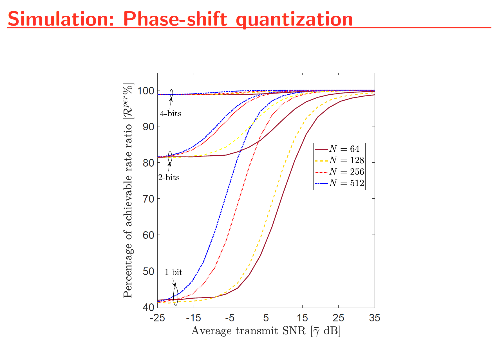

# Abstract

#### Reconfigurable intelligent surfaces (RISs) have been viewed as a vital physical- layer transmission technology for next-generation wireless systems. While the current state-of-art wireless standard is the 5th generation (5G), the RISs have emerged as a novel option to satisfy the rising demands for higher data rates, improved network coverage, increased reliability, and energy efficiency in wire- less communications for sixth-generation (6G) and beyond. The need for greener communication technologies for wireless networks has laid the groundwork for many innovative wireless power transfer methods. Because radio-frequency (RF) signals can convey both information and energy simultaneously, there has been much research interest in designing novel technologies for simultaneous wireless information and power transmission (SWIPT) and energy harvesting (EH). First, an RIS-assisted relay system model is proposed to improve the wireless system performance. By characterizing the optimal signal-to-noise ratio (SNR) attained through intelligent phase-shift controlling, the performance of the RIS- assisted relay system is investigated. Then, the performance of simultaneous wi- reless information and power transfer (SWIPT) is explored for the proposed RIS- assisted relay system. Also, the performance of linear EH models and non-linear EH models are compared via analytical and Monte-Carlo simulation results.

_Please see presentation report **Alan_Devkota_presentation.pdf** for more information_ (Click here to open: [Link Alan_Devkota_presentation.pdf click here](./Alan_Devkota_presentation.pdf))

_Please see my thesis report file for more information_ (Link: [Link Thesis_Report click here](https://search.proquest.com/openview/51b8734f2a802215f1a126e336c397f8/1?pq-origsite=gscholar&cbl=18750&diss=y))

# System and channel model

# Simulation: Harvested Energy

# Simulation: Average achievable rate

# Simulation: Phase-shift quantization

